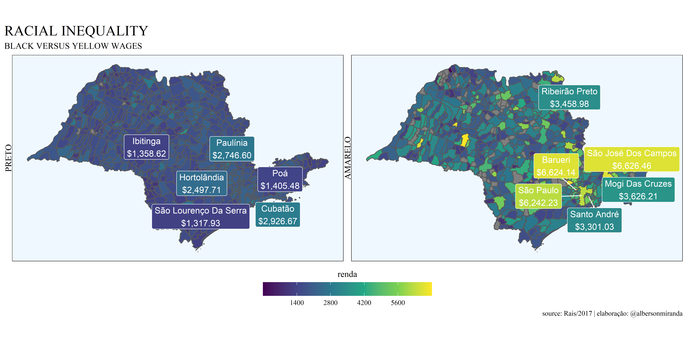

<!-- README.md is generated from README.Rmd. Please edit that file -->

# DESIGUALDADE RACIAL NO BRASIL

<!-- badges: start -->


<!-- badges: end -->

O objetivo desse pacote é facilitar a plotagem de gráficos que
evidenciam a desigualdade racial nos municípios brasileiros.

## Instalação

Você pode instalar a versão de desenvolvimento do pacote pelo
[GitHub](https://github.com/) com:

``` r
# install.packages("devtools")
devtools::install_github("albersonmiranda/desigualdade")
```

## Exemplo

Esse é um exemplo básico em que mostra como plotar o gráfico da
desigualdade de renda entre brancos e pretos nos municípios do Rio de
Janeiro, exibindo os 3 municípios de maior renda e os 3 de menor:

``` r
library(desigualdade)
RM("RJ", n.nomes = 3)
```

<!-- -->
