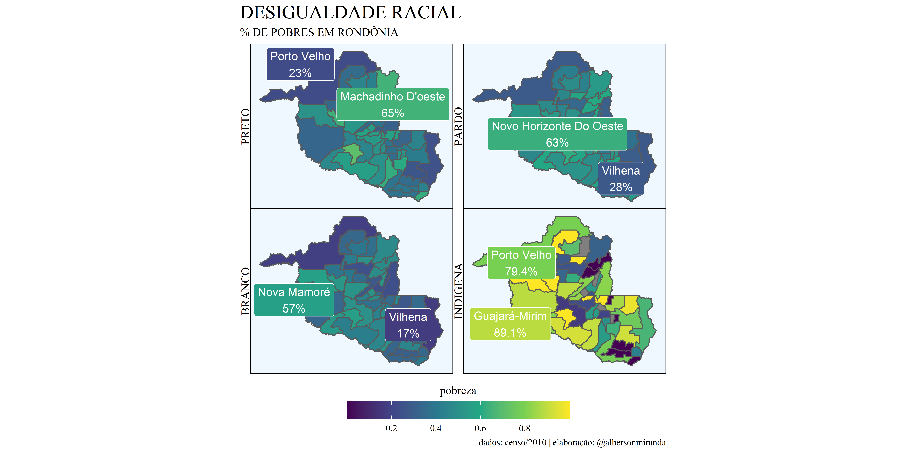
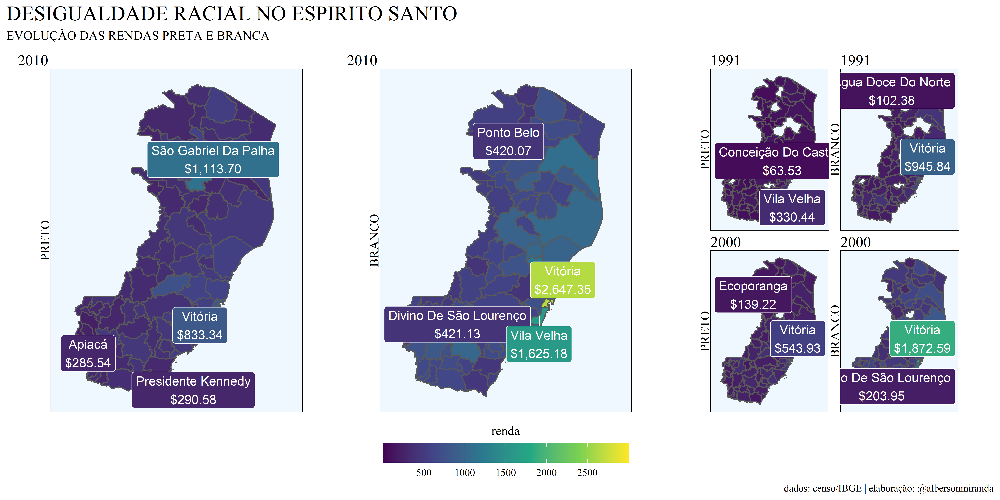

<!-- README.md is generated from README.Rmd. Please edit that file -->

# DESIGUALDADE RACIAL NO BRASIL

<!-- badges: start -->


[](https://www.tidyverse.org/lifecycle/#experimental)
<!-- badges: end -->

O objetivo desse pacote é facilitar a plotagem de gráficos que
evidenciam a desigualdade racial nos municípios brasileiros.

## Instalação

Você pode instalar a versão de desenvolvimento do pacote pelo
[GitHub](https://github.com/) com:

``` r
# install.packages("devtools")
devtools::install_github("albersonmiranda/desigualdade")
```

## Exemplo

Esse é um exemplo básico em que mostra como plotar o gráfico da
desigualdade de renda entre pretos e amarelos nos municípios de São
Paulo, exibindo os 3 municípios de maior renda e os 3 de menor:

``` r
library(desigualdade)

r_m("SP", etnia = c("PRETO", "AMARELO"), n_nomes = 3, p_nomes = 1000, to = 2000,
    caption = "dados: Censo/IBGE | elaboração: @albersonmiranda",
    title = "DESIGUALDADE RACIAL",
    subtitle = "RENDA PRETA VERSUS AMARELA EM SP")
```

<!-- -->

Também pode-se utilizar o `patchwork` para controlar o layout do plot
final:

``` r
library(patchwork)

r_m("RJ", etnia = c("PRETO", "BRANCO", "INDIGENA"),
    n_nomes = 2, p_nomes = 1000, from = 200, to = 1000, by = 200,
    caption = "dados: Censo/IBGE | elaboração: @albersonmiranda",
    title = "DESIGUALDADE RACIAL",
    subtitle = "RENDA BRANCA VERSUS PRETA E INDIGENA NO RIO DE JANEIRO") +
  plot_layout(ncol = 3, widths = c(2,1,1))
```

<!-- -->

É possível ir mais além e combinar vários `r_m()` com diferentes
argumentos:

``` r

library(ggplot2)

design = "
AABBCC
AABBDD
"
r_m("ES", etnia = c("PRETO", "BRANCO"), ref = "2010", n_nomes = 2,
    caption = "dados: Censo/IBGE | elaboração: @albersonmiranda",
    title =  "DESIGUALDADE RACIAL NO ESPIRITO SANTO",
    subtitle = "EVOLUÇÃO DAS RENDAS PRETA E BRANCA") *
  ggtitle("2010") +
  
  r_m("ES", etnia = c("PRETO", "BRANCO"), ref = "1991", n_nomes = 1,
      bar = FALSE) * ggtitle("1991") +
  
  r_m("ES", etnia = c("PRETO", "BRANCO"), ref = "2000", n_nomes = 1,
      bar = FALSE) * ggtitle("2000") +
  
  plot_layout(design = design)
```

<!-- -->
